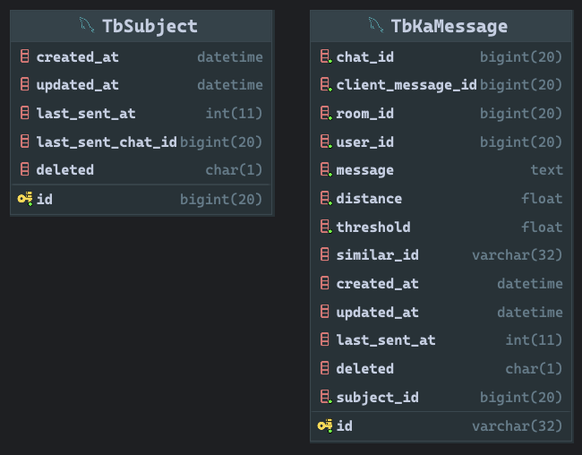

# Handong Feed Validator
> - This project is a FastAPI-based system that compares request messages with existing messages in a database to detect duplicates based on message similarity using angular distance.

## Table of Contents
- [Key Features](#key-features)
- [Installation](#installation)
- [Installation and Setup](#installation-and-setup)
- [Alembic Migration](#alembic-migration-for-reference)
- [Database Schema Overview](#database-schema-overview)
- [API Documentation](#api-documentation)
- [Notes](#notes)

## Key Features

1. **Efficient Duplicate Detection**: 
   - Uses **TF-IDF vectorization** and **Annoy Index** to quickly compare new messages with existing ones, detecting duplicates based on **similarity**.

2. **Threshold-Based Matching**: 
   - Messages are considered duplicates only if they fall below a customizable similarity **threshold**.

3. **Fast Similarity Search**: 
   - Employs **Annoy (Approximate Nearest Neighbors)** for fast, scalable nearest neighbor search, ensuring real-time detection even with large datasets.

4. **Automatic Index Rebuilding**: 
   - After each new message, the **Annoy index** is automatically rebuilt to maintain up-to-date comparisons without manual intervention.

5. **Subject Management**: 
   - Groups related messages into **subjects**, tracking the latest message in each subject for efficient clustering.

6. **Artifacts Storage**: 
   - Saves and reloads the **TF-IDF model** and **Annoy index**, ensuring fast startup and efficient comparisons.

## Installation
```shell
pip install -r requirements.txt
```

## Installation and Setup
### 1. Set up a Python virtual environment (optional but recommended)
```bash
python3 -m venv .venv
source .venv/bin/activate  # macOS/Linux
.venv\Scripts\activate     # Windows
```

### 2. Install required packages

```bash
pip install -r requirements.txt
```

### 3. Configure environment variables

Create a .env file in the project root with the following content:

```env
DB_HOST=<your_db_host>
DB_NAME=<your_db_name>
DB_USERNAME=<your_db_username>
DB_PASSWORD=<your_db_password>
DB_PORT=<your_db_port>  # Default is 3306
```

### 4. Run the Server

Once everything is set up, you can run the FastAPI server:

```bash
uvicorn main:app --reload
```
The server will run by default at http://127.0.0.1:8000.

## Alembic Migration (For reference)
### 1. Generating a Migration File
After modifying your models, you need to create a migration file to update the database schema. To automatically generate a migration file based on the model changes, run the following command:
```shell
alembic revision --autogenerate -m "Add your migration description here"
```
This command detects the differences between the database schema and the SQLAlchemy models, and generates a migration file accordingly.

Once the migration file is generated, you can find it in the alembic/versions directory. `Review and edit` the migration file to ensure that it contains the **correct SQL commands for creating, modifying, or dropping** tables.

### 2.  Applying Database Migrations
After generating a migration file, apply the migrations to the database using the following command:
```shell
alembic upgrade head
```
This command applies all pending migrations to update the database schema to the latest version.
> Note that this command DIRECTLY MODIFY YOUR DB SCHEMA.   
> Make sure that your migration file contains the **correct SQL commands**.

### 3. Downgrading the Database
If you need to revert a migration, you can downgrade the database to the previous version using the following command:
```shell
alembic downgrade -1
```
This command rolls back the most recent migration. If you want to downgrade to a specific version, you can specify the migration revision ID:
```shell
alembic downgrade <revision_id>
```


## Database Schema Overview


## API Documentation
### `/api/kafeed/validate` (POST)
#### Description
>Receives message and checks for duplication by comparing it with existing messages in the database.

#### Request Body
```json
{
    "room_id": 1234567890,
    "user_id": 1234567890,
    "chat_id": 1234567890,
    "client_message_id": 1234567890,
    "message": "Your message text here",
    "sent_at": 1609459200
}
```
#### Response:
- On success
  ```json
  {
    "chat_id": 0,
    "message": "New message" | "Duplicate message" | "Similar message, distance: {distance}",
    "subject_id": 0
  }
   ```
- If an error occurs 
  ```json
  {
    "detail": [
      {
        "loc": [
          "string",
          0
        ],
        "msg": "string",
        "type": "string"
      }
    ]
  }
  ```

## Notes
- The threshold for considering a message as a similar message can be adjusted in the ValidateService class within the code.